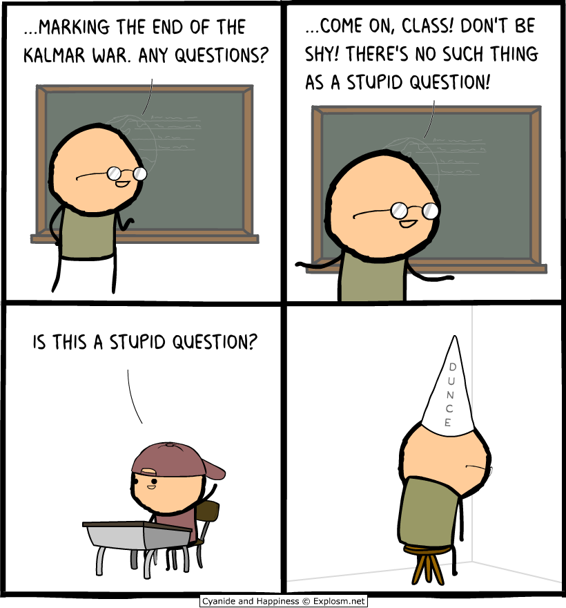

    

## Stupid Questions Are Stupid

It is likely that many people have heard the phrase, “There are no stupid questions,” at least once in their lives. Armed with this knowledge, some of these individuals may strut into Q&A forums like Stack Overflow and blurt out whatever ill-conceived query comes to mind, expecting frequenters to bow down to the familiar precept - even as their eye might twitch ever so slightly - and construct an answer, packaged in civility to rival a debutant’s, that addresses each facet of their confusion. “I need help ASAP,” posters may demand boldly. Unfortunately (or perhaps, fortunately, as a form of discouragement of laziness), the respondents of Stack Overflow will answer just as baldly: “RTFM”; “STFW”; “Have you heard of this new invention called Google?” All and more are acceptable answers to the what are considered “non-smart” (less politically correctly, frankly, stupid) questions that pop up with some regularity everywhere that questions are asked. An example of a non-smart question is this [question](https://stackoverflow.com/questions/5886112/c-i-have-two-questions) on Stack Overflow. 

The question is entitled “C++ I have two questions,” and is further expanded by the poster saying, “Please help me with my homework.” This is only a completely unacceptable question because a close inspection of the full question reveals that the poster is asking for his homework to be done for him. If you just heard a record scratch, you are not alone. According to Eric Steven Raymond, author of [How To Ask Questions The Smart Way]( http://www.catb.org/esr/faqs/smart-questions.html#code), “It is OK to ask for hints, but not for entire solutions.”  Where the poster truly went wrong was only including his homework prompt and a request for help, and not any of his own attempts at solving the problem. Like a commenter on that thread said: “We're not against giving you advice, but please give us more details. What have you tried so far? Where are you stuck? We're not just going to give you the answer.”

## Be Dumb Smartly

No one will deny that the fields of software engineering and computer programming are complex and impossible to master entirely, which is why so many charitable strangers devote their free time to (mostly) patiently answering questions from beginners. It is important, however, to show that you value their assistance and time by making it clear that you have attempted to search for solutions already, by using Google or a thorough perusal of documentation, perhaps, and articulating your question in a clear, easily understood fashion. An example of a good, smart question according to both Mr. Raymond and myself would be this [post]( https://stackoverflow.com/questions/14050195/what-is-the-difference-between-and-in-directive-scope-in-angularjs). The post’s title is clear (“What is the difference between '@' and '=' in directive scope in AngularJS?”), and in the extended description the poster affirms that he has already tried to solve the problem on his own (“I've read the AngularJS documentation on the topic carefully, and then fiddled around with a directive”), provides relevant snippets of code to show where he is experiencing the problem, and delineates each area of his confusion in separate mini-questions. 

## Why Good Questions Are Good

It is extremely important for software engineers and other would-be experts in similar technical fields to become very familiar with the process of asking smart questions. As mentioned earlier, such fields are expansive and unlikely to be mastered in entirety by any one individual. To be successful in software engineering, etc., the individual needs to know how to find information on their own through independent research (Googling, reading documentation/earlier questions) and when it is appropriate to post a question of their own to ask for someone else’s expertise. A smart question asker is someone who can diagnose and solve many of their own problems, and is considerate of both their own and others’ times. In the future, thanks to the insights of why smart questions are important and how to ask smart questions, I (and hopefully others) will be sure to more carefully craft our questions. 

