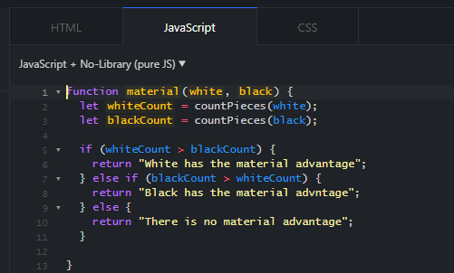

    

## Stupid Questions Are Stupid

It is likely that many people have heard the phrase, “There are no stupid questions,” at least once in their lives. Armed with this knowledge, some of these individuals may strut into Q&A forums like Stack Overflow and blurt out whatever ill-conceived query comes to mind, expecting frequenters to bow down to the familiar precept - even as their eye might twitch ever so slightly - and construct an answer, packaged in civility to rival a debutant’s, that addresses each facet of their confusion. “I need help ASAP,” posters may demand boldly. Unfortunately (or perhaps, fortunately, as a form of discouragement of laziness), the respondents of Stack Overflow will answer just as baldly: “RTFM”; “STFW”; “Have you heard of this new invention called Google?” All and more are acceptable answers to the what are considered “non-smart” (less politically correctly, frankly, stupid) questions that pop up with some regularity everywhere that questions are asked. An example of a non-smart question is this [question](https://stackoverflow.com/questions/5886112/c-i-have-two-questions) on Stack Overflow. 

The question is entitled “C++ I have two questions,” and is further expanded by the poster saying, “Please help me with my homework.” This is only a completely unacceptable question because a close inspection reveals that the poster is asking for his homework to be done for him. If you just heard a record scratch, you are not alone. According to Eric Steven Raymond, author of [How To Ask Questions The Smart Way]( http://www.catb.org/esr/faqs/smart-questions.html#code), “It is OK to ask for hints, but not for entire solutions.”  

## Why Good Questions Are Good

## Be Dumb Smartly

