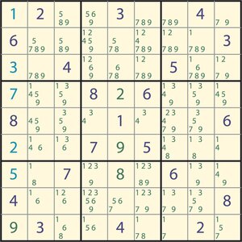

  

In my ICS 212 course, I was tasked to find a way to solve a given hexadecimal sudoku problem using recusion, Java, and Eclipse. I was given help and assistance with code by my professor, Carleton Moore, and classmates I bounced errors off of. The recursive strategy for finding a solution to a sudoku problem was: 

"i. If all cells are filled, see if this Sudoku is valid. If it is valid, we have found a solution. If not, this Sudoku is not a solution. Base case 1

ii. If at least one cell is not filled, see what values are legal for this cell:

  - If no values are legal, then this Sudoku is not a solution. Base case 2

  - If one or more values are legal, place each legal values in the cell in turn, one at a time. For each legal value, recursively attempt to find a solution that fills the remaining empty cells.

  - If a solution is found for at least one legal value, set the Sudoku to reflect this solution, and return that a solution was found.

  - If no solution is found for any legal value, reset this cell to the value it had when this method was called, and report that this Sudoku does not have a solution.

  - Every time the code recursively attempts to find a solution, it will fill cells in the Sudoku grid. If the attempt is not successful, returning, your code must restore the Sudoku grid to the values had before the call."

The algorithm I eventually developed was an example of backtracking, and I certainly had to backtrack often as well in order to fix both logic and coding errors in my program. I managed to solve sudoku problems using a recursive strategy at the end of the day, however! By completing this project, I learned how to implement a recursive algorithm, gained a deeper comprehension of "backtracking," and further developed my Java skills. 
