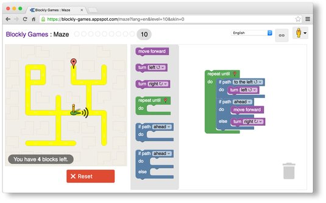

  
  

This project was one of my first experiences coding in high school. Utilizing the Google Maps API and Blockly (described as "a client-side library for the programming language JavaScript for creating block-based visual programming languages and editors" on Wikipedia), I was led to create a basic UI comprising three buttons: "Choose Location," "Surprise Me," and "Activity Starter." I then used the ListPicker and Activity Starter components of Blockly to finish coding the app's functionality, which was to be able to explore different locations in my hometown (Greensboro, North Carolina), be "surprised" with an unexpected location in the same city, and receive directions to a certain address in that city. 

