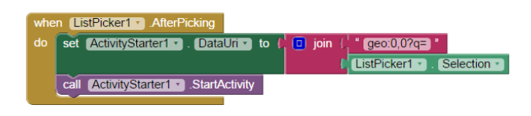

  
  

This project was one of my first experiences coding in high school. Utilizing the Google Maps API and Blockly (described as "a client-side library for the programming language JavaScript for creating block-based visual programming languages and editors" on Wikipedia), I was led to create a basic UI comprising three buttons: "Choose Location," "Surprise Me," and "Activity Starter." I then used the ListPicker and Activity Starter components of Blockly to finish coding the app's functionality, which was to be able to explore different locations in my hometown (Greensboro, North Carolina), be "surprised" with an unexpected location in the same city, and receive directions to a certain address in that city. 

I did not work on this project alone. I was placed in a group of three people, both of whom were also completely new to programming. Although Blockly does seem extremely simple now that I have gained experience working with coding languages like Java and JavaScript, at the time it was more than enough to challenge me and my other group members to complete our task. I was responsible for figuring out how to implement Google Maps API into our app.

This experience taught me about APIs, which I had never heard of before, and lists, and that coding could be an area I was interested in pursuing later. At the time, my future was very uncertain and the memory of how I felt seeing our app work for the first time did help me land on computer science as a major. Working in a group on a project that all of us felt frustrated by also helped me develop greater communication and collaboration skills. 

