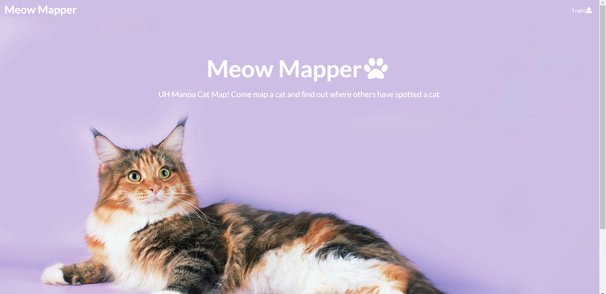

Using Meteor, basic Javascript, and a little HTML, I can officially say I have created my first real website! It even has a ".com" address. This project is [Meow Mapper](https://meowmapper.com/), created for a computer science class designed to help students become familiar with fundamental concepts in software engineering. It is designed to address a problem on the campus of UH Manoa, which is a large quantity of stray cats. Relying on user-generated data in the form of uploaded images tagged with the pictured cat's location, its end goal is to reduce the number of strays on campus by encouraging an active spay-and-neuter program facilitated by student volunteers and adoptions by members of the UH community. 

In this project, I worked with three classmates. We divided up tasks fairly among us so that no one person had to complete an unfair amount of work. For my part, I was in charge of creating the "Snatch a Cat" page and both administrator and user pages and functionality for "Volunteers". To create the "Snatch a Cat" page, I had to learn how to and utilize schemas and reading data from a database. To create the pages and functionality for "Volunteers", I had to become competent in writing to databases using forms. 

All of this work was completing using IntelliJ, Github Organizations and repositories, and DigitalOcean to host the IP address and for deployment. For a more detailed history of this project's process and code, please visit our [Github Organization](https://github.com/meow-mapper) and our organization’s [GitHub Page](https://meow-mapper.github.io/). 

